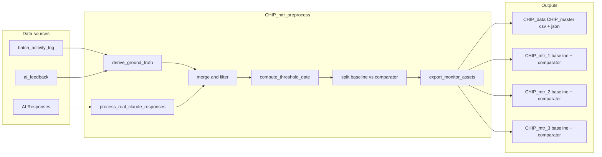

# CHIP Preprocess and Monitor Updates Plan

## 0. Full dimensional data: include all batch-related fields (imperative)

**Requirement:** Every data element from the original sources (AI Responses, batch_activity_log, ai_feedback) that can be associated to a batchId must be present in the final baseline and comparator datasets. No column filtering at export—monitors will pre-filter in their Python code, and future pipeline/live endpoints may differ per monitor.

**Current gaps:**

- **AI Responses** ([process_real_claude_responses](c:\Users\samne\PycharmProjects\chip_mtrs\CHIP_mtr_preprocess.py)): Only `businessKey`, `batchId`, `ai_verification_time`, `ai_overall_status`, `testName`, `ai_meets_specification` are emitted. Missing: from **headerData** (material_id, plant_id, batch_number, generated_by, date_generated, system, material_id_validation, plant_id_validation_result, batch_number_validation_result, dom_validation_result, system_validation_result); **document_type** (BG/CCA/DA/EM from file structure); from **rows[].data** (e.g. row_id, material, batch, inspection_lot, usage_decision_code, user_status, process_order, sled_bbd, coi, ai_status, and validation_result fields); from **qeList**/qe/emProduct (qeId, submissionStatus, fillingCountry, submissionType, plannedSubmissionDate, etc. where scalar and flattenable).
- **Ground truth** ([derive_ground_truth](c:\Users\samne\PycharmProjects\chip_mtrs\CHIP_mtr_preprocess.py)): Only `batchId`, `hitl_qa_decision`, `hitl_reviewer_id`, `hitl_review_time`. Missing: batch-level summaries from **batch_activity_log** (e.g. activity_event_count, first_activity_timestamp, last_activity_timestamp, activity_categories_seen, activity_field_names_seen, or flags like has_ai_verified, has_failed); from **ai_feedback** (e.g. feedback_event_count, first_feedback_at, last_feedback_at, feedback_actions, feedback_type; optionally parsed **context** fields such as section_title, page_type, path for first/last feedback).
- **Export** ([export_monitor_assets](c:\Users\samne\PycharmProjects\chip_mtrs\CHIP_mtr_preprocess.py)): Only `BASE_COLUMNS + cols_to_keep` are written, so any enriched column is dropped.

**Planned changes:**

- **Enrich `process_real_claude_responses`:** For each flattened row, attach all flattenable dimensions from the same file/record:
  - Add **header-level** fields to every row from that file: material_id, plant_id, batch_number, generated_by, date_generated, system, and validation booleans (material_id_validation, plant_id_validation_result, etc.).
  - Add **document_type** (or source_schema): infer from structure (headerData+rows → "BG", qeList → "CCA", qe+validationSummary → "DA", emProduct → "EM").
  - For **BG** rows: add row*id and, from row.data, scalar fields (material, batch, inspection_lot, usage_decision_code, user_status, process_order, sled_bbd, coi, ai_status, and key validation_result / validation_status fields) with a consistent prefix (e.g. row*) to avoid collisions.
  - For **CCA/DA/EM**: add item identifier (qeId/qe_no/lot_no, etc.) and scalar attributes from the current item (e.g. submissionStatus, fillingCountry, submissionType, plannedSubmissionDate; or mediaName, sampleType, etc.) again with a prefix if needed.
- **Enrich batch-level data from activity and feedback:** Add a function (e.g. `enrich_batch_dimensions(df_merged, activity_path, feedback_path)`) that, for each unique batchId, computes from batch_activity_log: activity_event_count, first_activity_timestamp, last_activity_timestamp, and optionally a delimited list or JSON of categories and field_names; from ai_feedback: feedback_event_count, first_feedback_at, last_feedback_at, list of actions, feedback_type. Merge these onto the existing dataframe on batchId (one row per AI row, so batch-level fields repeat per row of that batch—acceptable for “all data available”).
- **Export full dataset:** In `export_monitor_assets`, **do not filter columns**. Export all columns present in the passed DataFrame (df_base, df_comp) to the baseline and comparator CSV/JSON. Remove the `cols_to_keep` column filter; keep `cols_to_keep` only for documenting which columns each monitor currently uses in its schema (for README or for generating a **full** schema that includes every column). So: same wide dataset is written for all three monitors; only row filtering (e.g. by ai_overall_status or cm_term) may differ per monitor.
- **Full schema per monitor:** Update each monitor’s `modelop_schema.json` to declare **all** exported columns in `inputSchema.items.properties`, with appropriate role/dataClass/type (predictor/categorical etc.) for dimensions that are not score/label so the platform and future monitors know what is available. Monitors 1–3 then select the subset they need in `init`/`metrics` (e.g. via schema roles or by filtering the dataframe to the columns they use).

**Implementation notes:**

- Keep a single merged `df_final` (one row per AI response record, keyed by businessKey/batchId); batch-level enrichments from activity/feedback repeat for every row of that batch.
- Use native Python types and strings for new columns so CSV/JSON export and ModelOp ingestion remain straightforward. For list-like values (e.g. activity_categories_seen), use a consistent format (e.g. pipe-separated or JSON string).
- Document in the script and README that baseline/comparator are “full dimensional” and that each monitor is responsible for selecting the columns it needs.

---

## 1. Preprocess: Baseline vs comparator and date threshold

**Current behavior** ([CHIP_mtr_preprocess.py](c:\Users\samne\PycharmProjects\chip_mtrs\CHIP_mtr_preprocess.py)): The pipeline already creates baseline and comparator per monitor (CHIP_mtr_1, CHIP_mtr_2, CHIP_mtr_3) via `export_monitor_assets()`. The split uses a fixed `days_threshold=30` from the max `ai_verification_time`. Baseline/comparator files are only written when the filtered DataFrame is non-empty (lines 186–193), so if the 30-day split leaves one side empty, that file is missing.

**Data context** (from [BMS_Data_Discovery_Report.pdf](c:\Users\samne\PycharmProjects\chip_mtrs\archive\BMS_Data_Discovery_Report.pdf), [batch_activity_log_202603042226.json](c:\Users\samne\PycharmProjects\chip_mtrs\batch_activity_log_202603042226.json), [ai_feedback_202603042225.json](c:\Users\samne\PycharmProjects\chip_mtrs\ai_feedback_202603042225.json), and [AI Responses](c:\Users\samne\PycharmProjects\chip_mtrs\AI Responses)):

- Activity log: 44,256 records; timestamps in 2025–2026.
- AI feedback: 47 records; `created_at` from 2025-12-27 to 2026-02-09+.
- AI Responses: 7 JSON files with `verification_time` (e.g. 2026-02-27, 2026-03-03).
- Merged `df_final` is driven by AI response rows and uses `ai_verification_time` for the split.

**Planned changes:**

- **Always write both baseline and comparator**  
  In `export_monitor_assets()`, always write baseline and comparator CSV/JSON for each monitor, even when the corresponding DataFrame is empty (write empty list/empty CSV with headers). This guarantees both assets exist for ModelOp and for local testing.
- **Data-driven split date (record-volume–oriented)**  
  Replace or complement the fixed `days_threshold` with a threshold derived from the data so both segments have adequate volume when possible:
  - **Option A (recommended):** Compute a single split date from `df_final['ai_verification_time']` so that both baseline and comparator have at least a minimum record count (e.g. 10 or 20). If the earliest date plus min count already exceeds half the data, use the median (or configurable percentile) date as the split.
  - **Option B:** Keep a configurable `days_threshold` but compute a **default** when not provided: e.g. use the median (or 60th percentile) of `ai_verification_time` so baseline ≈ 50–60% and comparator ≈ 40–50%.
  - Add a small helper, e.g. `compute_threshold_date(df_final, min_records_baseline=20, min_records_comparator=20)` or `compute_threshold_date(df_final, percentile=0.6)`, and use it in `execute_pipeline()` so `threshold_date` is set from data. Retain an optional override (e.g. `days_threshold` or explicit `threshold_date`) for reproducibility.
- **Documentation**  
  In the script docstring or comments, document that the split is based on `ai_verification_time`, that the threshold can be record-volume–based or percentile-based, and that cloud/JSON sources (activity log, feedback, AI Responses) drive the date range.

---

## 1b. Master dataset (CHIP_data) and split configurability

**Master dataset:** Create a new folder **CHIP_data/** in the project root and write a single **master** dataset (full merged rows, all columns) in two formats:

- **CHIP_data/CHIP_master.csv**
- **CHIP_data/CHIP_master.json**

**Additional columns in the master only:**

- **dataset:** Literal `"baseline"` or `"comparator"` indicating which subset each record belongs to after the split.
- **split_method:** A string encoding how the split was performed and the threshold value, separated by a hyphen, e.g.:
  - `date-30` (date-based split with 30-day threshold)
  - `date-60`
  - `volume-5000` (record-volume–based split with baseline size 5000)
  - `percentile-0.6` (if using percentile-based split)
    So the format is `"{method}-{value}"` where method is one of date | volume | percentile and value is the numeric or percentile value used.

**Configurability (fold in from [map.py](c:\Users\samne\PycharmProjects\chip_mtrs\map.py)):** Support the same split and config options as map.py so the pipeline is consistent and auditable:

- **split_method:** `'DATE'` | `'VOLUME'` (and optionally `'PERCENTILE'` if implementing percentile-based default). Drives how baseline vs comparator are determined.
- **days_threshold:** Used when split_method is DATE; number of days before max date for the cutoff.
- **volume_threshold:** Used when split_method is VOLUME; number of records for the baseline (older records by ai_verification_time).
- **baseline_start_date:** Optional; filter the merged data to records on or after this date before applying the split (useful to exclude very old data).
- **Config file:** Optional load from **config.yaml** (as in map.py) for monitor_1_stability, monitor_2_performance, monitor_3_calibration (allowed statuses, CM term mapping). If config.yaml exists, use it; else use hardcoded DEFAULT_CONFIG. This keeps TP/FP/TN/FN and allowed statuses configurable as production data or business definitions evolve.

**Execution order:** After computing baseline and comparator (and optionally applying data-driven default when thresholds are not set), build one combined dataframe with a `dataset` column and a constant `split_method` column; write it to CHIP_data/CHIP_master.csv and CHIP_data/CHIP_master.json. Then continue to export per-monitor baseline/comparator assets from the same baseline and comparator data.

---

## 1c. Discovery docs: data properties, relationships, hierarchies

Use [BMS_Data_Discovery_Report.pdf](c:\Users\samne\PycharmProjects\chip_mtrs\archive\BMS_Data_Discovery_Report.pdf) and [BMS_CHIP_Source_Categorical_Discovery.pdf](c:\Users\samne\PycharmProjects\chip_mtrs\archive\BMS_CHIP_Source_Categorical_Discovery.pdf) to ensure the pipeline leverages **all** data in the source JSON files:

- **Data Discovery Report:** Record counts (44,256 activity; 47 feedback; 7 AI response files), distribution of categories and field_name, and raw AI status strings. Use this to validate which columns and value sets exist when enriching (e.g. which activity categories to aggregate, which field_name values to include in batch-level summaries).
- **Categorical Discovery:** The nested hierarchy **Category -> Field Name -> New Value** (e.g. batch-status-changed -> batch_status -> READY-FOR-APPROVAL, IN-PROGRESS, COMPLETED; failed -> coa_status, em_status, … -> FAILED; ai-verified -> da_status, change_control_status, … -> AI-VERIFIED) defines alternate ground-truth indicators and all dimensions to expose. When enriching batch-level data from activity log, include:
  - Aggregates that reflect these categories and field names (e.g. activity_categories_seen, activity_field_names_seen, or flags like has_ai_verified, has_failed, has_batch_status_completed).
- **Relationships:** batchId is the unique identifier across activity log, ai_feedback, and AI Responses; businessKey is the row-level key within AI output. Ensure every record in the master and in monitor exports carries all dimensions that can be joined or derived from these sources so that future monitor versions or different pipeline endpoints can filter or aggregate as needed.

---

## 1d. DMN threshold alignment with ModelOp criteria

**Goal:** Ensure threshold values in the CHIP monitor **DMN** (decision table) files align with ModelOp Data Drift, Performance, and Stability monitor documentation, and with any project-specific criteria (e.g. from “model ops.pdf” when that document is available).

**ModelOp reference (Confluence):**

- [Data & Concept Drift Monitoring](https://modelopdocs.atlassian.net/wiki/spaces/dv32/pages/1764461951/Data+Concept+Drift+Monitoring): Drift monitors compare baseline vs sample; metrics include KS p-value, JS distance, KL divergence, Epps-Singleton p-value. Typical rule: **p-value < 0.05** indicates significant drift (reject null that distributions are the same).
- [Performance Monitoring](https://modelopdocs.atlassian.net/wiki/spaces/dv32/pages/1764461664/Performance+Monitoring): Classification metrics (accuracy, precision, recall, F1, AUC); thresholds are business-defined. OOTB example [Performance_Classification.dmn](c:\Users\samne\PycharmProjects\chip_mtrs\modelop\ootb_monitors\performance_classification\Performance_Classification.dmn): auc <= 0.7, precision <= 0.6, recall <= 0.6, f1_score <= 0.7 trigger failure.
- **Stability (PSI/CSI):** OOTB [Stability_CSI_PSI.dmn](c:\Users\samne\PycharmProjects\chip_mtrs\modelop\ootb_monitors\stability_analysis\Stability_CSI_PSI.dmn): **stability_index > 0.15** (HIGH risk), **> 0.2** (MEDIUM), **> 0.25** (LOW) trigger failure.

**Planned changes:**

- **Create or update CHIP-specific DMN files** (e.g. in CHIP_mtr_1, CHIP_mtr_2, CHIP_mtr_3 or a shared dmn folder) that reference the **exact metric names** produced by each monitor (e.g. top-level keys such as `auc`, `precision`, `recall`, `f1_score` for M2; `data_drift` / test_name Kolmogorov-Smirnov and p-value for M1/M3; `stability` and stability_index for M1/M3). Set threshold values in line with ModelOp criteria above, or with project-specific values from “model ops.pdf” if that document defines different bounds.
- **Document** that the **cm_term** mapping (TP/FP/TN/FN) in config may be updated as more production data becomes available or as the ModelOp CS team and business align on definitions (e.g. what counts as “successful halt” vs “false alarm”). When cm_term or business rules change, update config.yaml (or DEFAULT_CONFIG) and, if needed, adjust DMN thresholds so they remain consistent with the monitor output structure and with ModelOp platform expectations.
- **Double-check:** Before finalizing, verify DMN input variable names and types match the JSON payload keys and types returned by each monitor’s `metrics()` function (e.g. double for AUC, array structure for data_drift/stability as in OOTB DMN).

---

## 1e. Future-proofing: updated flat files, latest-file selection, upsert, and README

**Goal:** Support introducing new AI feedback, batch activity log, and AI response files without removing existing data; enable record-level analysis across multiple datasets and larger merged master datasets; handle growing volume with upsert/overwrite until production data pipelines (e.g. S3) are available post-UAT.

- **Subdirectory layout:** Use (or introduce) a clear layout, e.g. `data/batch_activity_log/`, `data/ai_feedback/`, `data/ai_responses/` (or keep `AI Responses/`). Document where to drop new files.
- **Most recent file selection:** Implement `get_latest_flat_file(directory, pattern)` returning the newest file by mtime or by parsed timestamp in filename (e.g. `batch_activity_log_YYYYMMDDHHMMSS.json`). No need to remove old data; script uses latest extract. Wire preprocess to configurable source paths and call this per source type.
- **Multi-file merge with upsert:** Optionally read all files per source, order by file date, merge with upsert by stable key (e.g. activity: batch_number+id; feedback: batch_id+id; AI Responses: businessKey); process oldest to newest, overwrite by key. Configurable: `use_latest_file_only` vs. `merge_all_files_upsert`.
- **README (sweet transition):** Create **docs/DATA_INGESTION.md** or **FLAT_FILE_INGESTION.md** instructing users: (1) Where to place files and how to override paths. (2) File naming convention for "most recent." (3) How script chooses input (latest vs. merge with upsert). (4) Step-by-step: add new files, run pipeline—no removal of old data. (5) Record-level analysis and larger masters when upsert is enabled. (6) Path to production: flat files until UAT; then S3; flat file support remains.
- **Implementation:** Helpers `get_latest_flat_file`, optional `load_and_merge_with_upsert`; preprocess accepts configurable paths and latest-only vs. merge-all-upsert flag.

---

## 2. Monitor scripts: Test data filenames and JSON output of metrics

**Filename mismatch:** Monitor 1 and 3 load `mtr_1_baseline.json` / `mtr_1_comparator.json` and `mtr_3_baseline.json` / `mtr_3_comparator.json`, but the preprocess writes `CHIP_mtr_1_baseline.json`, `CHIP_mtr_1_comparator.json`, etc. Monitor 2 loads `mtr_2_comparator.json` but preprocess writes `CHIP_mtr_2_comparator.json`. So local test blocks fail unless run from a directory that has the short names or the scripts are updated. With the full-dimensional export (Section 0), baseline/comparator will contain all columns; each monitor must **pre-filter** the loaded dataframe to the columns it needs (e.g. for schema roles or for the metrics computation) so they work correctly with the wide dataset.

**Planned changes:**

- **Use preprocess output filenames in test blocks**
  - [CHIP_mtr_1/CHIP_mtr1_ai_stability_drift.py](c:\Users\samne\PycharmProjects\chip_mtrs\CHIP_mtr_1\CHIP_mtr1_ai_stability_drift.py): In `if __name__ == "__main__"`, load `CHIP_mtr_1_baseline.json` and `CHIP_mtr_1_comparator.json` (not `mtr_1`).
  - [CHIP_mtr_2/CHIP_mtr2_performance.py](c:\Users\samne\PycharmProjects\chip_mtrs\CHIP_mtr_2\CHIP_mtr2_performance.py): Load `CHIP_mtr_2_comparator.json`.
  - [CHIP_mtr_3/CHIP_mtr3_hitl_stability.py](c:\Users\samne\PycharmProjects\chip_mtrs\CHIP_mtr_3\CHIP_mtr3_hitl_stability.py): Load `CHIP_mtr_3_baseline.json` and `CHIP_mtr_3_comparator.json`.
- **Write metrics payload to JSON on each test run**  
  In each monitor’s `if __name__ == "__main__"` block, after `results = list(metrics(...))`, write the yielded payload to a JSON file so every test run persists the last output, e.g.:
  - M1: `CHIP_mtr_1_test_results.json`
  - M2: `CHIP_mtr_2_test_results.json`
  - M3: `CHIP_mtr_3_test_results.json`  
    Use the same directory as the script (or the current working directory). Write with `json.dump(results[0], f, indent=2)` (and handle non-serializable types if needed, e.g. numpy floats).

---

## 3. ModelOp visualizations in monitor output

Per [Monitor Output Structure](https://modelopdocs.atlassian.net/wiki/spaces/dv33/pages/2051900216/Monitor+Output+Structure), the platform expects specific keys in the metrics payload for charts and tables: `time_line_graph`, `generic_line_graph`, `decimal_line_graph`, `generic_bar_graph`, `horizontal_bar_graph`, `generic_table`, `generic_scatter_plot`, `generic_pie_chart`, `generic_donut_chart`. Each has a defined shape (title, axis labels, `data`, `categories` where applicable).

**Planned approach:** In each monitor’s `metrics()` function, after building the existing result dict (stability/drift or performance), add a small helper or inline logic that builds visualization dicts from the **actual** metrics and merges them into the same dict that is yielded. Use a subset of the available chart types to tell a clear story without duplicating the same information.

**Monitor 1 (AI stability/drift)**

- **generic_bar_graph:** e.g. “PSI / Drift by feature” — categories = feature/column names (from stability/drift result), data1 = PSI or CSI values, data2 = JS distance (or similar) so baseline vs sample drift is visible.
- **generic_table:** Rows for key metrics (e.g. max/min CSI feature, top drift features, PSI for score column) so the table summarizes “what to look at first.”
- **generic_donut_chart** or **generic_pie_chart:** Distribution of `ai_overall_status` in the **sample** (PASS/FAIL counts) to show current AI outcome mix.

**Monitor 2 (Performance)**

- **generic_bar_graph:** “Classification metrics” — categories = Accuracy, Precision, Recall, F1, AUC; data1 = metric values from the performance result.
- **generic_table:** Confusion matrix as rows (e.g. Predicted 0/1 vs Actual 0/1) so it renders as a table.
- **generic_donut_chart:** Distribution of predicted classes (or actual labels) in the sample to show class balance.

**Monitor 3 (HITL stability)**

- **generic_bar_graph:** Drift/stability by feature (e.g. `hitl_qa_decision`, `hitl_reviewer_id`, or testName) — same pattern as M1, from the stability/drift result.
- **generic_table:** Summary of key stability/drift metrics (e.g. CSI/PSI by feature, worst drift feature).
- **generic_donut_chart:** Distribution of `hitl_qa_decision` (Approved / Rejected / Reprocess / Pending) in the sample.

**Implementation notes:**

- Parse the existing `result` (e.g. `result['data_drift']`, `result['stability']`, or performance top-level keys) to get feature names and values; avoid hardcoding feature names so it stays valid for schema changes.
- Ensure numeric values are native Python floats (not numpy) for JSON serialization.
- Keep visualization keys consistent with the docs (exact key names and nested structure for `data`, `categories`, etc.).

---

## 4. Order of implementation

1. **Full dimensional data (preprocess):** Enrich the preprocess script so all batch-related fields from AI Responses, batch_activity_log, and ai_feedback are included; add enrich_batch_dimensions() and expand process_real_claude_responses(); change export to all columns and full schema. Add split configurability (split_method, days_threshold, volume_threshold, baseline_start_date, optional config.yaml) per map.py; then implement data-driven threshold and “always write both baseline and comparator” in [CHIP_mtr_preprocess.py](c:\Users\samne\PycharmProjects\chip_mtrs\CHIP_mtr_preprocess.py); Create CHIP_data/ and write CHIP_master.csv and CHIP_master.json (full dataset plus dataset and split_method columns). Run pipeline and confirm CHIP_data/ and CHIP_mtr_1/2/3 have the expected files with the full column set.
2. **Monitor test data and JSON export:** Update the three monitor scripts to use `CHIP_mtr`_ filenames, to pre-filter the loaded dataframe to the columns needed for that monitor (so they work with the new wide dataset), and to write the metrics payload to `_\_test_results.json` in the test block.
3. **Visualizations:** Add visualization construction (and merge into the yielded dict) in each monitor’s `metrics()` function; run each script and confirm the written `*_test_results.json` contains the new keys and that values are valid for the platform (and serializable).
4. **DMN alignment:** Create or update CHIP-specific DMN files for M1/M2/M3 so threshold values align with ModelOp drift, performance, and stability criteria and with **model ops.pdf** (in repo); document cm_term and threshold evolution with production data and ModelOp CS.
5. **Future-proofing and README:** Implement latest-file selection (and optional multi-file upsert) for flat file ingestion; add configurable source paths; create **docs/DATA_INGESTION.md** (or FLAT_FILE_INGESTION.md) with instructions for introducing new flat files and path to S3 post-UAT.

---

## 5. Diagram (data flow)

---

## 6. References

- [Data & Concept Drift Monitoring](https://modelopdocs.atlassian.net/wiki/spaces/dv32/pages/1764461951/Data+Concept+Drift+Monitoring) — baseline vs sample, drift metrics, output shape.
- [Performance Monitoring](https://modelopdocs.atlassian.net/wiki/spaces/dv32/pages/1764461664/Performance+Monitoring) — sample-only input, classification metrics, output shape.
- [Monitor Output Structure](https://modelopdocs.atlassian.net/wiki/spaces/dv33/pages/2051900216/Monitor+Output+Structure) — exact keys and formats for charts and tables.
