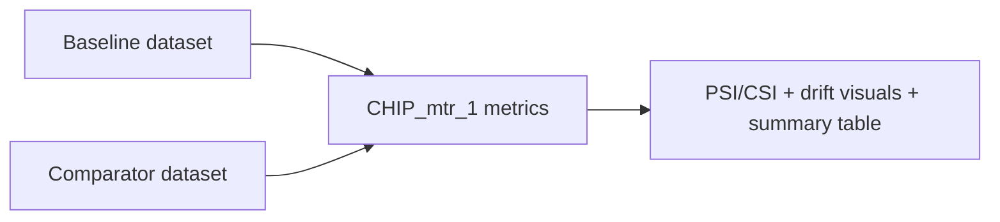

# CHIP_mtr_1 Monitor

_AI output stability and drift monitoring across baseline and comparator windows._

## Overview

This monitor compares baseline versus comparator behavior for AI outcomes. You use it to detect distribution shifts and stability movement before they become production issues.

## Why this matters

- You get early warning on AI behavior drift.
- You can quickly identify which feature dimensions are moving.
- You provide governance-friendly evidence with consistent visual outputs.

## Visual logic



## ModelOp Center setup

### Entry points

- Primary source: `CHIP_mtr1_ai_stability_drift.py`
- Runtime functions: `init(job_json)`, `metrics(df_baseline, df_sample)`

### Required assets

- Baseline Data
- Comparator Data

### Job parameters

`job_parameters.json` location: `CHIP_mtr_1/job_parameters.json`

Precedence:

1. Runtime `job_json.rawJson.jobParameters`
2. Local `job_parameters.json`
3. Script defaults

| Parameter | Type | Default | Purpose |
|---|---|---|---|
| `AI_FAIL_VALUES` | list of strings | `["FAIL"]` | Values treated as AI failure class |
| `M1_TOP_N_FEATURES` | number | `20` | Max features rendered in charts |

Example:

```json
{
  "AI_FAIL_VALUES": ["FAIL", "PLANNED"],
  "M1_TOP_N_FEATURES": 15
}
```

## Local development

1. Run preprocessing first to generate shared CSVs in `CHIP_mtr_data/CHIP_data`.
2. Run `python CHIP_mtr_1/CHIP_mtr1_ai_stability_drift.py`.
3. Check local output file `CHIP_mtr_1_test_results.json` if generated.

## Output contract

- Summary table: largest/smallest CSI and overall PSI context
- Bar and horizontal bar charts: CSI and JS distance by feature
- Scatter plot: CSI versus JS distance
- Pie and donut charts: comparator AI outcome mix

## Troubleshooting

Canonical terminal decoder: see `../README.md` (Master Troubleshooting Table).

| Context | Likely cause | Fix |
|---|---|---|
| `modelop` import fails during local run | Runtime package is not installed locally.<br>Typical terminal signal:<br>`ModuleNotFoundError: No module named 'modelop'` | Run in ModelOp Runtime, or install the local runtime dependency stack used by your platform. |
| FutureWarning about `__MISSING__` dtype appears | This warning is emitted by ModelOp stability internals and is currently non-fatal.<br>It indicates a potential future pandas/runtime compatibility issue. | Treat as non-blocking for current runs.<br>Track dependency versions for upgrade planning, and optionally suppress this known warning in local runner logs for cleaner onboarding output. |
| Stability summary shows `Largest/Smallest Stability Shift (CSI)` as `None` / `null` | CSI summary keys were not populated in this run shape, even though other metrics (for example PSI) are present. | Keep run if core outputs are present.<br>Owner enhancement: add fallback derivation of top/bottom CSI from `stability[0].values[*].stability_index`. |
| No baseline/comparator files found | Preprocessing did not run, source paths changed, or output location was overridden. | Run preprocessing first and verify files in `CHIP_mtr_data/CHIP_data`.<br>If ingestion is migrated (for example S3), validate resolved source and output paths in preprocessing logs before M1 execution. |
| Chart output is sparse | `M1_TOP_N_FEATURES` is too low or available monitored features are limited. | Increase `M1_TOP_N_FEATURES` in runtime job parameters or `CHIP_mtr_1/job_parameters.json`. |
| Class mapping does not match expectations | `AI_FAIL_VALUES` does not match incoming score/status values from preprocess output. | Update `AI_FAIL_VALUES` in runtime job parameters or `CHIP_mtr_1/job_parameters.json` to align with business classification semantics. |

## Additional resources

| Resource | Link |
|---|---|
| ModelOp Custom Monitor Training | `docs/ModelOp_Center_Custom_Monitor_Developer_Intro_Training_Jan-2024.pptx.pdf` |
| Monitor results analysis | `docs/CHIP_mtr_test_results_analysis.md` |
| ModelOp Center - Getting Started | [Getting Started with ModelOp Center](https://modelopdocs.atlassian.net/wiki/spaces/dv33/pages/1764458543/Getting+Started+with+ModelOp+Center) |
| ModelOp Center - Terminology | [ModelOp Center Terminology](https://modelopdocs.atlassian.net/wiki/spaces/dv33/pages/1764458571/ModelOp+Center+Terminology) |
| ModelOp Center - Command Center | [Getting Oriented with ModelOp Center's Command Center](https://modelopdocs.atlassian.net/wiki/spaces/dv33/pages/1764458595/Getting+Oriented+with+ModelOp+Center+s+Command+Center) |

