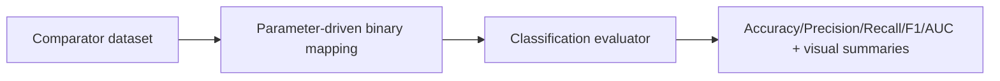

# CHIP_mtr_2 Monitor

_AI versus human QA concordance monitoring for classification performance._

## Overview

This monitor measures agreement between AI decisions and human QA decisions on comparator data. It converts labels into a configurable binary mapping and then computes standard classification metrics.

## Why this matters

- You can quantify AI and HITL alignment with objective metrics.
- You can tune business-specific label mappings without changing code.
- You can show consistent evidence for model governance and quality reviews.

## Visual logic



## ModelOp Center setup

### Entry points

- Primary source: `CHIP_mtr2_performance.py`
- Runtime functions: `init(job_json)`, `metrics(dataframe)`

### Required assets

- Comparator Data

### Job parameters

`job_parameters.json` location: `CHIP_mtr_2/job_parameters.json`

Precedence:

1. Runtime `job_json.rawJson.jobParameters`
2. Local `job_parameters.json`
3. Script defaults

| Parameter | Type | Default | Purpose |
|---|---|---|---|
| `AI_FAIL_VALUES` | list of strings | `["FAIL"]` | Values mapped to AI positive class |
| `HITL_POSITIVE_VALUES` | list of strings | `["REJECTED","REPROCESS","PENDING"]` | Values mapped to HITL positive class |

Example:

```json
{
  "AI_FAIL_VALUES": ["FAIL", "PLANNED"],
  "HITL_POSITIVE_VALUES": ["REJECTED", "REPROCESS", "PENDING"]
}
```

## Local development

1. Run preprocessing first to generate shared comparator CSVs in `CHIP_mtr_data/CHIP_data`.
2. Run `python CHIP_mtr_2/CHIP_mtr2_performance.py`.
3. Check local output file `CHIP_mtr_2_test_results.json` if generated.

## Output contract

- Summary table: confusion details, metric scores, and date context
- Bar and horizontal bar charts: core concordance metrics
- Pie and donut charts: comparator class balance

Known caveat:

- AUC may be `null` when comparator data contains one effective class.

## Troubleshooting

Canonical terminal decoder: see `../README.md` (Master Troubleshooting Table).

| Context | Likely cause | Fix |
|---|---|---|
| `modelop` import fails during local run | Runtime package is not installed locally.<br>Typical terminal signal:<br>`ModuleNotFoundError: No module named 'modelop'` | Run in ModelOp Runtime, or install the local runtime dependency stack used by your platform.<br>For onboarding, this is usually an environment issue, not a monitor logic issue. |
| AUC warning appears and AUC is `null` | Current run label state is single-class after mapping.<br>Observed state from latest run:<br>`hitl_class_balance_donut_chart.categories = ["1"]`<br>`hitl_class_balance_donut_chart.data.decision_count = [232]`<br>`ai_hitl_concordance_summary_table["Auc"] = null`<br>This triggers sklearn warnings because ROC AUC needs both classes (0 and 1). | If this aligns with business intent for the selected window, treat as non-fatal and display AUC as `N/A (single-class comparator)`.<br>If not aligned, adjust label mapping so comparator includes both classes.<br>Example change in `CHIP_mtr_2/job_parameters.json`:<br>Current:<br>`"HITL_POSITIVE_VALUES": ["REJECTED", "REPROCESS", "PENDING"]`<br>Modified (common BMS interpretation):<br>`"HITL_POSITIVE_VALUES": ["REJECTED", "REPROCESS"]` |
| Confusion matrix warning about single label shape | Comparator labels and predictions collapse to one class after mapping.<br>Terminal signal:<br>`UserWarning: A single label was found in 'y_true' and 'y_pred'...` | Keep run behavior if single-class windows are expected.<br>If dashboard consumers require stable 2x2 shape, normalize confusion matrix output in monitor code after evaluator execution (owner enhancement). |
| Accuracy looks unexpectedly low/high for BMS `>95%` agreement target | Mapping policy may not reflect business semantics.<br>Most common source is `PENDING` handling in `HITL_POSITIVE_VALUES` and FAIL mapping in `AI_FAIL_VALUES`. | Validate mappings with business process owners first.<br>Then update `CHIP_mtr_2/job_parameters.json` and rerun chain.<br>Recommended onboarding check:<br>1) verify mapped class distribution<br>2) confirm threshold rule interpretation<br>3) compare against `docs/CHIP_mtr_test_results_analysis.md`. |
| Comparator file is not found | Preprocessing did not run, path resolution failed, or source ingestion changed. | Run preprocessing first and confirm `CHIP_mtr_data/CHIP_data/CHIP_comparator.csv` exists.<br>If migrating to S3-backed ingestion, verify resolved source path/URI and row counts before M2 execution. |

## Additional resources

| Resource | Link |
|---|---|
| ModelOp Custom Monitor Training | `docs/ModelOp_Center_Custom_Monitor_Developer_Intro_Training_Jan-2024.pptx.pdf` |
| Monitor results analysis | `docs/CHIP_mtr_test_results_analysis.md` |
| ModelOp Center - Getting Started | [Getting Started with ModelOp Center](https://modelopdocs.atlassian.net/wiki/spaces/dv33/pages/1764458543/Getting+Started+with+ModelOp+Center) |
| ModelOp Center - Terminology | [ModelOp Center Terminology](https://modelopdocs.atlassian.net/wiki/spaces/dv33/pages/1764458571/ModelOp+Center+Terminology) |
| ModelOp Center - Command Center | [Getting Oriented with ModelOp Center's Command Center](https://modelopdocs.atlassian.net/wiki/spaces/dv33/pages/1764458595/Getting+Oriented+with+ModelOp+Center+s+Command+Center) |

