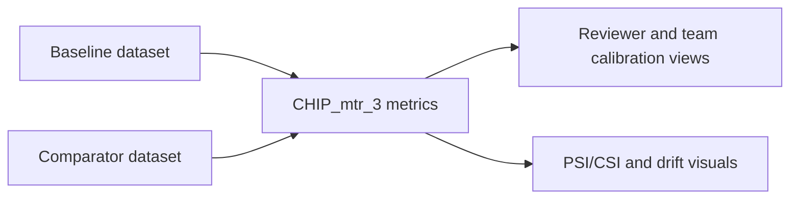

# CHIP_mtr_3 Monitor

_HITL reviewer calibration and stability monitoring across baseline and comparator windows._

## Overview

This monitor tracks human QA behavior over time, including reviewer-level drift and team-level calibration. It helps you identify policy drift, fatigue patterns, and consistency gaps.

## Why this matters

- You can monitor human decision stability, not just model output stability.
- You can compare each reviewer against team trends.
- You can provide audit-ready evidence for reviewer governance.

## Visual logic



## ModelOp Center setup

### Entry points

- Primary source: `CHIP_mtr3_hitl_stability.py`
- Runtime functions: `init(job_json)`, `metrics(df_baseline, df_sample)`

### Required assets

- Baseline Data
- Comparator Data

### Job parameters

`job_parameters.json` location: `CHIP_mtr_3/job_parameters.json`

Precedence:

1. Runtime `job_json.rawJson.jobParameters`
2. Local `job_parameters.json`
3. Script defaults

| Parameter | Type | Default | Purpose |
|---|---|---|---|
| `AI_FAIL_VALUES` | list of strings | `["FAIL"]` | Values treated as AI failure class |
| `HITL_POSITIVE_VALUES` | list of strings | `["REJECTED","REPROCESS","PENDING"]` | Values treated as HITL positive class |
| `M3_TOP_N_FEATURES` | number | `20` | Max features rendered in charts |

Example:

```json
{
  "AI_FAIL_VALUES": ["FAIL"],
  "HITL_POSITIVE_VALUES": ["REJECTED", "REPROCESS", "PENDING"],
  "M3_TOP_N_FEATURES": 15
}
```

## Local development

1. Run preprocessing first to generate shared CSVs in `CHIP_mtr_data/CHIP_data`.
2. Run `python CHIP_mtr_3/CHIP_mtr3_hitl_stability.py`.
3. Check local output file `CHIP_mtr_3_test_results.json` if generated.

## Output contract

- Summary table: PSI/CSI context plus reviewer-versus-team metrics
- Bar and horizontal bar charts: CSI and JS distance by feature
- Scatter plot: CSI versus JS distance
- Time line graph: daily rejection rate and review volume
- Pie and donut charts: comparator HITL decision mix

## Troubleshooting

Canonical terminal decoder: see `../README.md` (Master Troubleshooting Table).

| Context | Likely cause | Fix |
|---|---|---|
| `modelop` import fails during local run | Runtime package is not installed locally.<br>Typical terminal signal:<br>`ModuleNotFoundError: No module named 'modelop'` | Run in ModelOp Runtime, or install the local runtime dependency stack used by your platform.<br>For onboarding, this is an environment setup issue. |
| Reviewer rejection metrics look extreme (for example, all `1.0`) | M3 reuses HITL mapping semantics.<br>If all comparator decisions map to positive class, reviewer/team rates can saturate.<br>Current related comparator state (from M2 run):<br>`hitl_class_balance.categories = ["1"]`<br>`decision_count = [232]` | Confirm whether `PENDING` should count as a positive/rejection-like class in your process-control policy.<br>If not, update `CHIP_mtr_3/job_parameters.json`:<br>Current:<br>`"HITL_POSITIVE_VALUES": ["REJECTED", "REPROCESS", "PENDING"]`<br>Modified:<br>`"HITL_POSITIVE_VALUES": ["REJECTED", "REPROCESS"]` |
| Time line graph is empty | Date fields are missing, unparsable, or absent in comparator data.<br>M3 expects review/prediction timestamps to build trend lines. | Validate timestamp availability in preprocess outputs (`ai_verification_time`, `hitl_review_time`, activity timestamps).<br>If migrating ingestion sources (for example S3), add source-level validation logs before monitor execution. |
| Stability summary shows null top/bottom CSI feature | Stability payload may not contain explicit `CSI_max/min` summary keys for that run shape.<br>This is often a formatting/derivation issue, not necessarily a failed monitor. | Keep run if other stability metrics are present.<br>Owner enhancement: derive fallback max/min from `stability[0].values[*].stability_index` when explicit keys are absent. |

## Additional resources

| Resource | Link |
|---|---|
| ModelOp Custom Monitor Training | `docs/ModelOp_Center_Custom_Monitor_Developer_Intro_Training_Jan-2024.pptx.pdf` |
| Monitor results analysis | `docs/CHIP_mtr_test_results_analysis.md` |
| ModelOp Center - Getting Started | [Getting Started with ModelOp Center](https://modelopdocs.atlassian.net/wiki/spaces/dv33/pages/1764458543/Getting+Started+with+ModelOp+Center) |
| ModelOp Center - Terminology | [ModelOp Center Terminology](https://modelopdocs.atlassian.net/wiki/spaces/dv33/pages/1764458571/ModelOp+Center+Terminology) |
| ModelOp Center - Command Center | [Getting Oriented with ModelOp Center's Command Center](https://modelopdocs.atlassian.net/wiki/spaces/dv33/pages/1764458595/Getting+Oriented+with+ModelOp+Center+s+Command+Center) |

