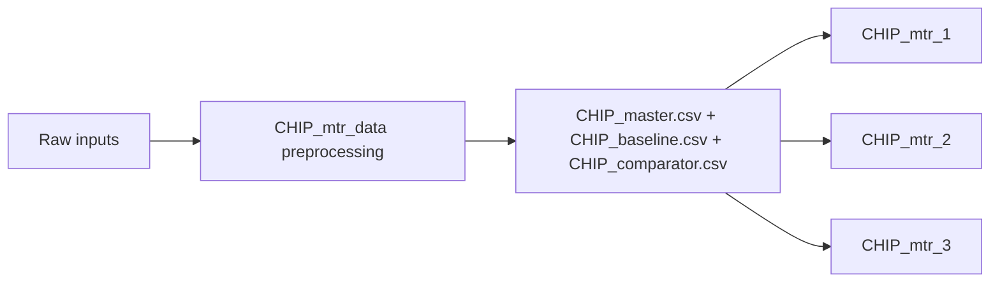

# CHIP_mtr_data Monitor

_Your preprocessing entry point for all CHIP monitor data._

## Overview

This monitor prepares the shared datasets used by all downstream CHIP monitors. You run it first, and it produces the master, baseline, and comparator CSVs consumed by `CHIP_mtr_1`, `CHIP_mtr_2`, and `CHIP_mtr_3`.

## Why this matters

- You keep ETL logic in one place instead of duplicating transforms in each monitor.
- You enforce one source of truth for baseline and comparator data.
- You make monitor onboarding easier for governance and operations teams.

## Visual logic



## ModelOp Center setup

### Entry points

- Primary source wrapper: `preprocessing.py` (`init(job_json)`, `metrics()`)
- ETL engine: `CHIP_mtr_preprocess.py`

### Required assets

- Batch activity log JSON with top-level key `batch_activity_log`
- AI feedback JSON with top-level key `ai_feedback`
- AI response JSON directory (or archive)

### Job parameters

`job_parameters.json` location: `CHIP_mtr_data/job_parameters.json`

Precedence:

1. Runtime `job_json.rawJson.jobParameters`
2. Local `job_parameters.json`
3. Script defaults

| Parameter | Type | Default | Purpose |
|---|---|---|---|
| `output_dir` | string | `CHIP_data` | Output directory for generated CSVs |
| `activity_file` | string | `batch_activity_log_202603042226.json` | Activity log override |
| `feedback_file` | string | `ai_feedback_202603042225.json` | Feedback log override |
| `ai_responses_dir` | string | `AI Responses` | AI responses directory override |
| `split_method` | string | `DATE` | Data split method (`DATE` or `VOLUME`) |
| `days_threshold` | number or null | `null` | Days-based comparator window |
| `volume_threshold` | number | `5000` | Record-count comparator threshold |
| `baseline_start_date` | string or null | `null` | Optional lower bound for baseline |
| `min_records_baseline` | number | `20` | Baseline minimum records |
| `min_records_comparator` | number | `20` | Comparator minimum records |
| `sources` | object | see `job_parameters.json` | Optional latest-file selectors (`activity_pattern`, `feedback_pattern`) |
| `split` | object | see `job_parameters.json` | Optional nested split overrides (`baseline_fraction`, minimums) |
| `monitor_2_performance` | object | see `job_parameters.json` | TP/FP/TN/FN confusion-term mapping |
| `overwrite_readme` | boolean | `false` | Allow README regeneration |
| `overwrite_dmn` | boolean | `false` | Allow DMN regeneration |
| `overwrite_modelop_schema` | boolean | `false` | Allow schema regeneration |
| `overwrite_required_assets` | boolean | `false` | Allow required assets regeneration |
| `overwrite_blank_schema_asset` | boolean | `false` | Allow blank schema regeneration |

Example:

```json
{
  "split_method": "DATE",
  "output_dir": "CHIP_data",
  "volume_threshold": 5000
}
```

## Local development

1. Place raw files in `CHIP_mtr_data` (or configure overrides).
2. Run `python CHIP_mtr_data/CHIP_mtr_preprocess.py`.
3. Confirm generated files in `CHIP_mtr_data/CHIP_data`.

## Output contract

- `CHIP_master.csv` includes `dataset` and `split_method`.
- `CHIP_baseline.csv` and `CHIP_comparator.csv` are downstream monitor inputs.
- These outputs are implementation assets and should not be copied into monitor folders.

## Troubleshooting

Canonical terminal decoder: see `../README.md` (Master Troubleshooting Table).

| Context | Likely cause | Fix |
|---|---|---|
| Output shows `No AI records processed.` or missing output CSVs | Input data source paths are unresolved, files are absent, or ingestion source changed without aligned parameters.<br>This is the highest-risk operational failure for all downstream monitors. | Verify `job_parameters.json` source paths (`activity_file`, `feedback_file`, `ai_responses_dir`) and raw data availability.<br>If moving from flat files to S3-backed ingestion, validate source URI resolution and row counts before continuing. |
| Baseline/comparator split is unexpectedly small or imbalanced | Split policy is valid but not aligned to your desired KPI comparison window.<br>This can weaken Reliability interpretation (for example PSI threshold checks). | Adjust split controls in job parameters:<br>`split_method`, `days_threshold`, `volume_threshold`, `baseline_fraction`, `min_records_baseline`, `min_records_comparator`.<br>Re-run and confirm resulting date ranges and counts before monitor interpretation. |
| Downstream M2 shows AUC warnings / null AUC | Preprocess completed, but comparator label distribution may be single-class after mapping in monitor logic.<br>Current observed state from latest run: comparator class mix collapsed to class `1` only. | Treat preprocess as successful; then tune monitor mapping policy (`HITL_POSITIVE_VALUES`) in M2/M3 job parameters so comparator windows reflect intended business class behavior. |
| Unexpected parameter values at runtime | Runtime `job_json.rawJson.jobParameters` override local `job_parameters.json` values by design. | Check parameter precedence in order:<br>1) runtime `jobParameters`<br>2) local `job_parameters.json`<br>3) script defaults.<br>Align runtime orchestration settings with local test settings to avoid drift. |

## Additional resources

| Resource | Link |
|---|---|
| ModelOp Custom Monitor Training | `docs/ModelOp_Center_Custom_Monitor_Developer_Intro_Training_Jan-2024.pptx.pdf` |
| Data ingestion details | `docs/DATA_INGESTION.md` |
| ModelOp Center - Getting Started | [Getting Started with ModelOp Center](https://modelopdocs.atlassian.net/wiki/spaces/dv33/pages/1764458543/Getting+Started+with+ModelOp+Center) |
| ModelOp Center - Terminology | [ModelOp Center Terminology](https://modelopdocs.atlassian.net/wiki/spaces/dv33/pages/1764458571/ModelOp+Center+Terminology) |
| ModelOp Center - Command Center | [Getting Oriented with ModelOp Center's Command Center](https://modelopdocs.atlassian.net/wiki/spaces/dv33/pages/1764458595/Getting+Oriented+with+ModelOp+Center+s+Command+Center) |
