<div style="border:1px solid #d6d6d1; border-left:6px solid #006630; padding:10px 12px; margin:12px 0; background:#ffffff; color:#0b0d0a;">

#
# CHIP ModelOp Monitors

_Canonical project guide for the BMS CHIP custom monitor suite._

##  Overview

This repository contains one preprocessing monitor and three downstream custom monitors aligned to the BMS CHIP COA/Report validation use case:

- `CHIP_mtr_data` (shared ETL and monitor-ready datasets)
- `CHIP_mtr_1` (Model Output Stability / Drift)
- `CHIP_mtr_2` (Approval Concordance)
- `CHIP_mtr_3` (QA Calibration / Process Control)

Use this root README for project-level architecture, execution, troubleshooting, and visualization interpretation. Subdirectory READMEs focus on monitor-specific implementation details.

## Mermaid compatibility profile (GitHub native)

All README diagrams in this repository follow a GitHub-native compatibility profile:

- Use core Mermaid types supported in GitHub Markdown (`flowchart`, `sequenceDiagram`, `stateDiagram-v2`, `gantt`, `journey`, `pie`).
- Do not use `%%{init...}%%` renderer directives in committed README diagrams.
- Do not use ELK-specific layout settings in README Mermaid blocks.
- Prefer explicit, simple node IDs and labels for stable cross-renderer behavior.

##  Quick Start

Run the full local chain (preprocess -> M1 -> M2 -> M3) from the repository root:

```bash
python run_all_monitors.py
```

Expected success signals for first-time users:

- Preprocess step reports split counts and writes shared outputs in `CHIP_mtr_data/CHIP_data`.
- Each monitor prints a `[SUCCESS] Output written to ...` line for its local test result JSON.
- Runner shows all stages as completed and ends with `All steps completed successfully.`

##  Repository Structure

```text
.
├── CHIP_mtr_data/        # Preprocessing monitor and shared data outputs
├── CHIP_mtr_1/           # M1: AI output stability and drift
├── CHIP_mtr_2/           # M2: AI-vs-HITL agreement and performance
├── CHIP_mtr_3/           # M3: Reviewer/process calibration and stability
├── docs/                 # Analysis, onboarding, and supporting documentation
├── scripts/              # Utility and exploratory scripts
└── run_all_monitors.py   # Root runner: preprocess -> M1 -> M2 -> M3
```

##  End-to-End Flow

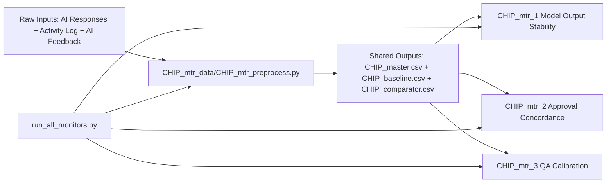

##  Execution Lifecycle

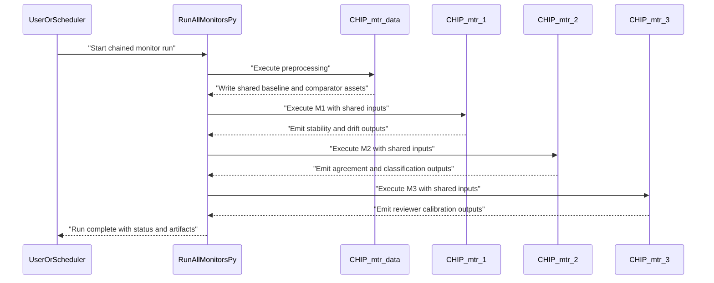

##  Proposed High-Level Visual Set

Use these Mermaid chart types to make project communication highly visual in onboarding and governance reviews:

| Mermaid type | Project-level purpose | Why it helps BMS CHIP stakeholders |
|---|---|---|
| `flowchart` | Dataflow and monitor dependency map | Clarifies shared ETL and monitor handoffs |
| `sequenceDiagram` | Runtime orchestration and execution order | Shows exactly what runs first and where failures surface |
| `stateDiagram-v2` | Monitor lifecycle states | Supports operational ownership and runbook design |
| `gantt` | Validation and release timeline | Frames readiness milestones and dependencies |
| `journey` | Stakeholder value path | Connects monitor outputs to QA/risk workflows |
| `flowchart` | Metric snapshot examples | Highest compatibility across Markdown renderers |
| `pie` | Class or decision composition | Mirrors M2/M3 class balance visuals |
| `flowchart` | Risk triage framing | Useful for prioritizing follow-up actions |

##  Project State Model

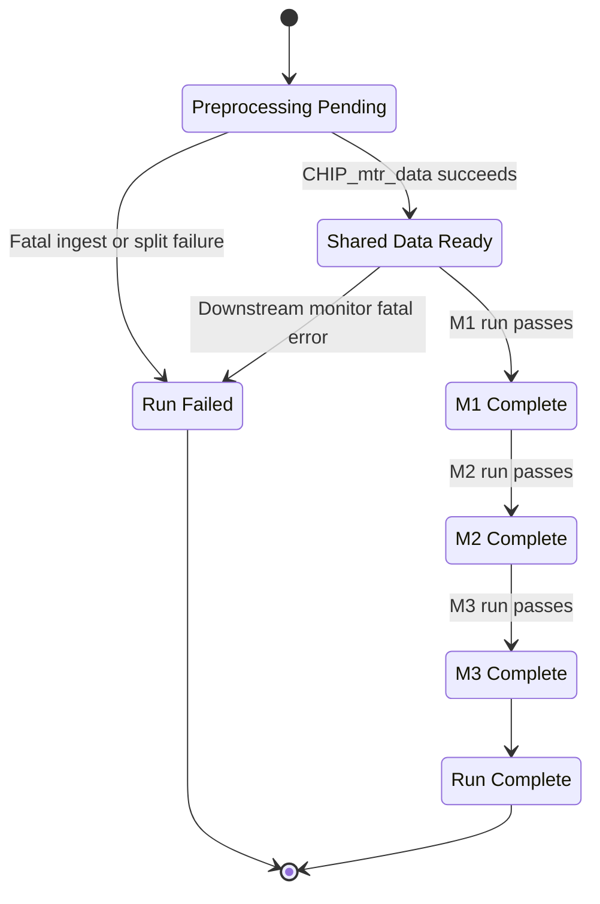

##  Release Timeline Example

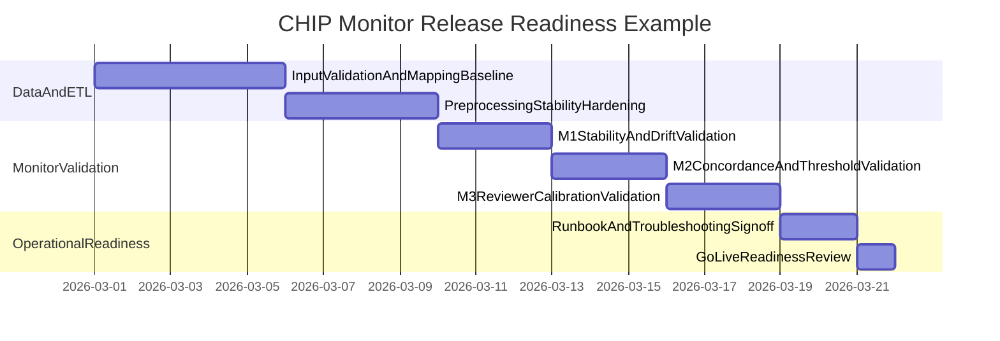

##  Stakeholder Journey Example

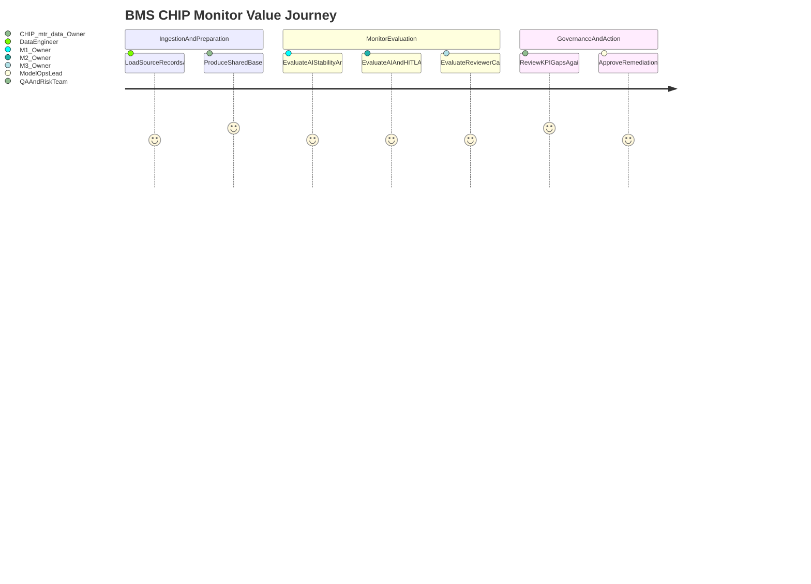

##  Master Troubleshooting Table (Canonical)

This is the canonical troubleshooting table referenced by all monitor READMEs.

| Terminal or logger statement | Impact on BMS criteria | Interpretation | When it matters | Owner action |
|---|---|---|---|---|
| `FutureWarning: ... "__MISSING__" ... incompatible dtype ...` | Indirect for M1 and M3 continuity.<br/>Can become blocking after dependency upgrades. | Non-fatal in current runs.<br/>Raised by stability internals, not by CHIP business logic directly. | During pandas or runtime package upgrades.<br/>When warning-free logs are operationally required. | Keep non-blocking for now.<br/>Track dependency versions and optionally suppress this known warning in local runner logs. |
| `UndefinedMetricWarning: Only one class is present in y_true. ROC AUC score is not defined.` | Direct for M2 Agreement reporting clarity. | Comparator labels are single-class after mapping.<br/>Current observed state:<br/>`categories = ["1"]`, `decision_count = [232]`, `Auc = null`. | When AUC is required by thresholds or stakeholder reporting. | Keep run as valid if window intent is single-class.<br/>If not intended, adjust mapping to produce both classes in comparator windows. |
| `UserWarning: A single label was found in 'y_true' and 'y_pred' ...` | Direct for M2 confusion matrix interpretability. | Confusion matrix can collapse to 1x1 for single-class windows. | When dashboards require fixed TP/FP/TN/FN structure. | Normalize confusion matrix output to fixed 2x2 shape after evaluation. |
| M1 or M3 summary shows `Largest/Smallest Stability Shift (CSI)` as `None` or `null` | Direct for Reliability and Process Control explainability. | CSI summary keys are absent in this run shape even if other outputs are valid. | When triage requires top-shifting feature names. | Add fallback derivation from `stability.values[*].stability_index` when explicit CSI keys are missing. |
| M2 output row shows `"Auc": null` | Direct for M2 business readability. | Statistically valid under single-class comparator labels, but easy to misread as failure. | During onboarding and executive review consumption. | Render as business text such as `N/A (single-class comparator window)` instead of bare null. |
| M2 or M3 metrics saturate (for example class mix all `"1"` and reviewer or team rejection `1.0`) | Direct for Agreement and Process Control interpretation. | Mapping policy drives class saturation.<br/>Current mapping includes `PENDING` in positive set. | When business intent treats `PENDING` as neutral rather than reject-like. | Revisit mapping policy with process owners.<br/>Common adjustment:<br/>`HITL_POSITIVE_VALUES = ["REJECTED", "REPROCESS"]`. |
| Preprocess logs imply narrow or imbalanced baseline and comparator windows | Direct for M1 Reliability threshold quality and secondary M2/M3 comparability. | Split is valid but may be statistically weak for KPI governance. | When PSI and agreement outcomes are used as acceptance criteria. | Make split policy explicit (`baseline_fraction`, minimum record thresholds, and window policy), then rerun. |
| `No AI records processed.` or missing baseline/comparator files | Critical blocker for all monitors. | Ingestion or path resolution failure, not a metric algorithm failure. | During flat-file to S3 migration, prefix changes, or permission updates. | Validate resolved source URIs and row counts first.<br/>Add explicit source and count logs before downstream monitor execution. |

##  Appendix: Example Mermaid Visuals for MTR Test Result Payloads

The examples below map common MTR payload structures to Mermaid visuals for documentation and stakeholder storytelling.

### MTR 1 (`CHIP_mtr_1_test_results.json`) Example Visuals

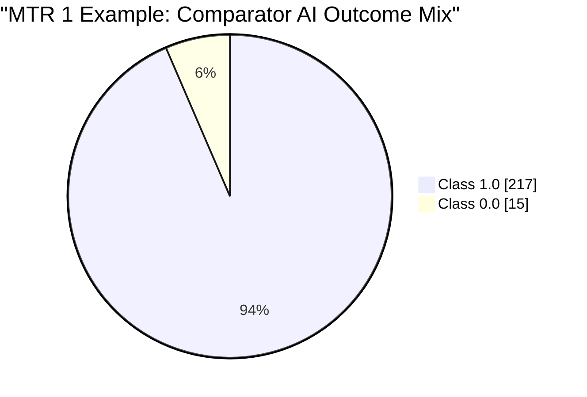

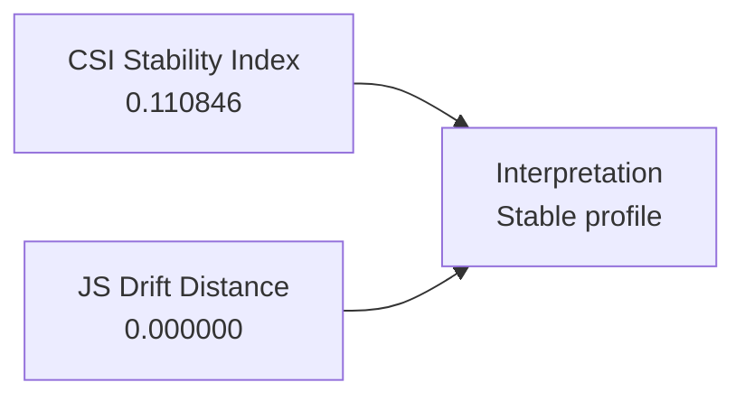

### MTR 2 (`CHIP_mtr_2_test_results.json`) Example Visuals

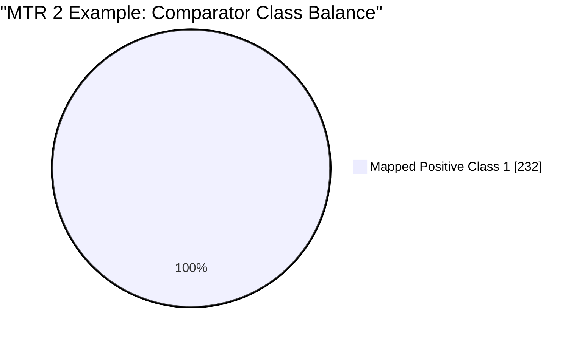

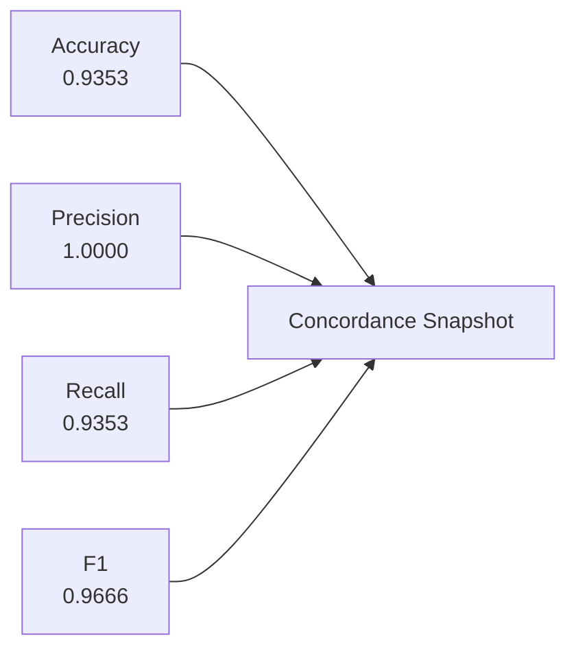

### MTR 3 (`CHIP_mtr_3_test_results.json`) Example Visuals

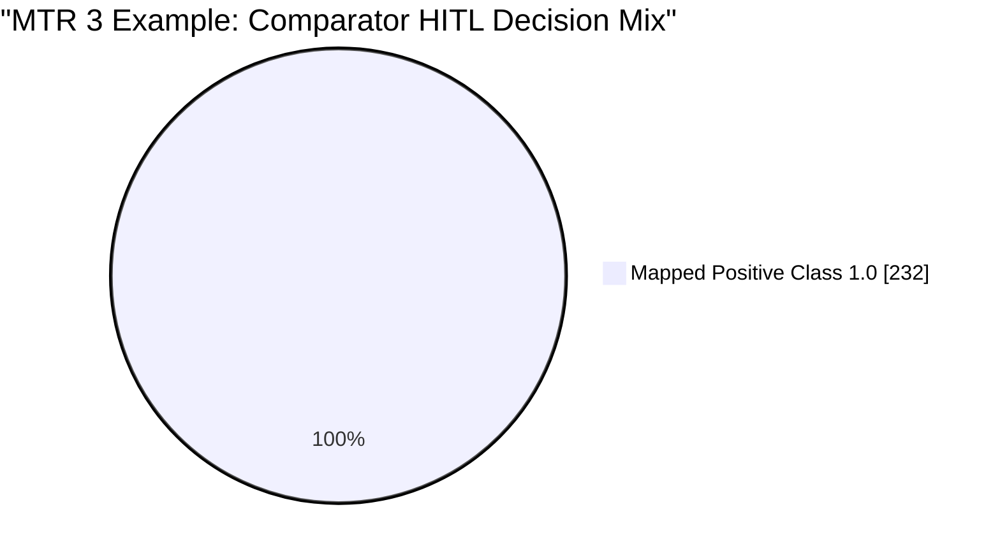

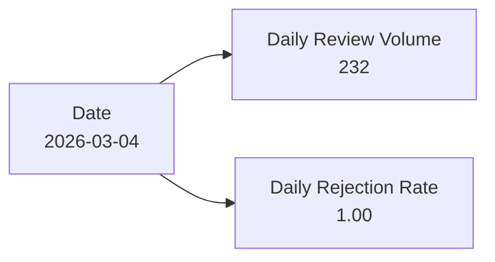

### Cross-Monitor Risk Triage Example

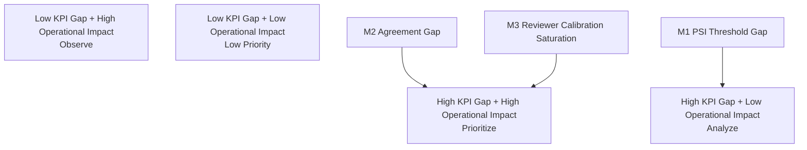

##  Subdirectory README Links

- Preprocessing monitor: `CHIP_mtr_data/README.md`
- M1 monitor: `CHIP_mtr_1/README.md`
- M2 monitor: `CHIP_mtr_2/README.md`
- M3 monitor: `CHIP_mtr_3/README.md`
- Aggregate analysis: `docs/CHIP_mtr_test_results_analysis.md`

## Additional resources

| Resource | Link |
|---|---|
| ModelOp Center - Getting Started | [Getting Started with ModelOp Center](https://modelopdocs.atlassian.net/wiki/spaces/dv33/pages/1764458543/Getting+Started+with+ModelOp+Center) |
| ModelOp Center - Terminology | [ModelOp Center Terminology](https://modelopdocs.atlassian.net/wiki/spaces/dv33/pages/1764458571/ModelOp+Center+Terminology) |
| ModelOp Center - Command Center | [Getting Oriented with ModelOp Center's Command Center](https://modelopdocs.atlassian.net/wiki/spaces/dv33/pages/1764458595/Getting+Oriented+with+ModelOp+Center+s+Command+Center) |