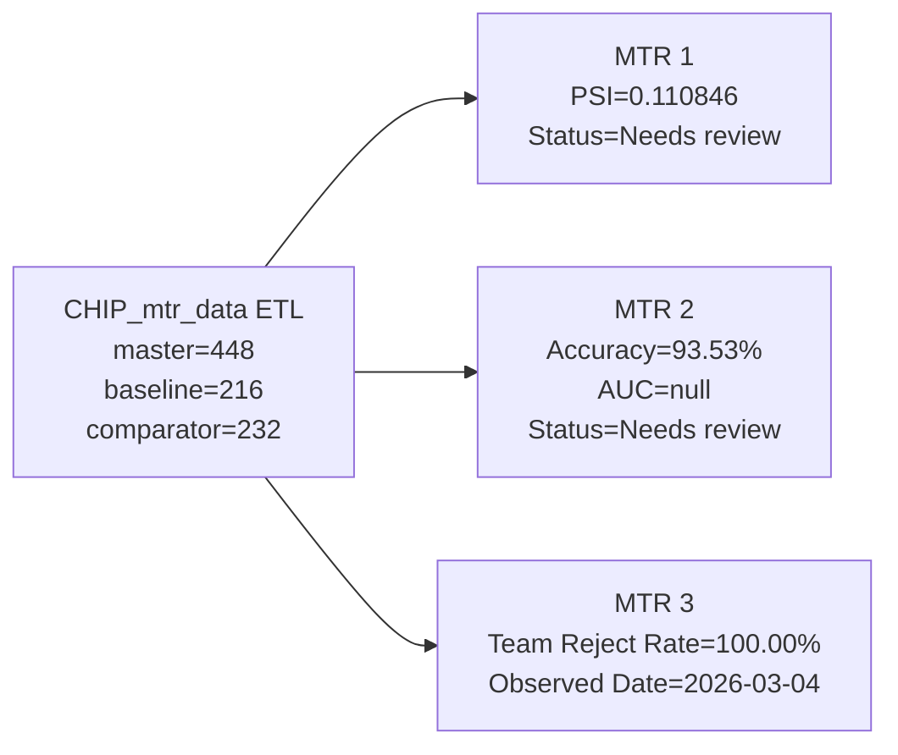
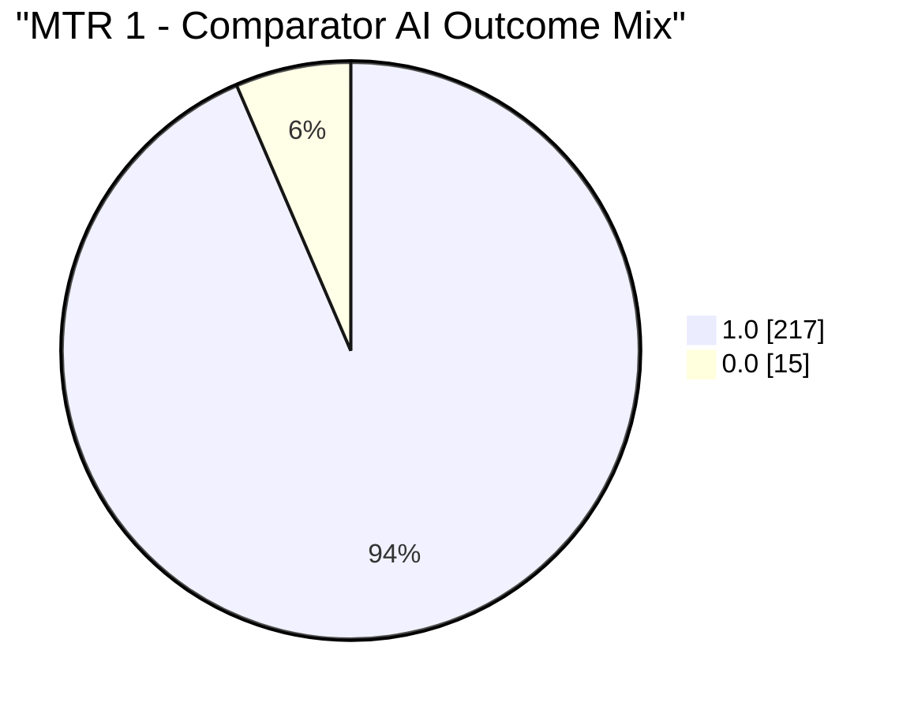
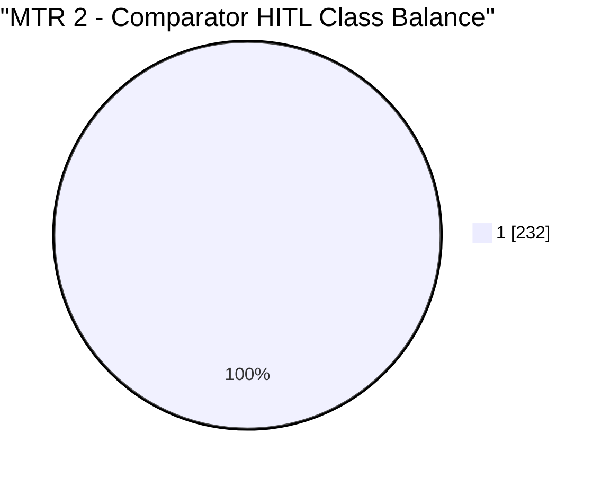
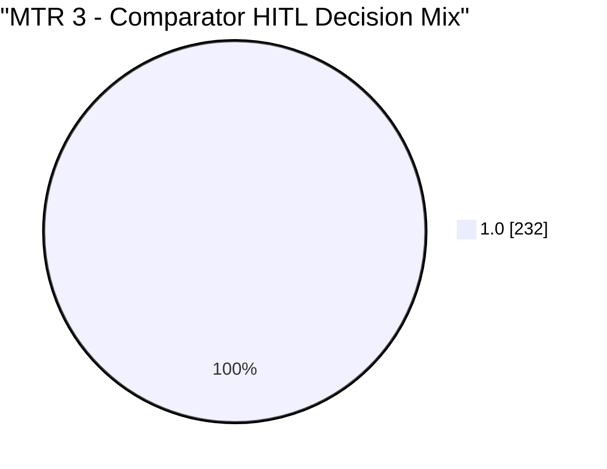
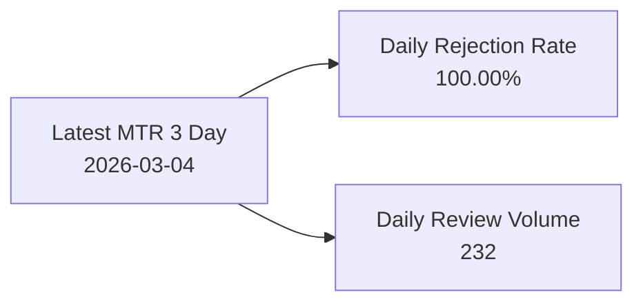

# CHIP Monitor Test Results – Auto-Generated Run Summary

**Run:** CHIP_mtr_data (preprocessing) -> MTR 1 -> MTR 2 -> MTR 3  
**Execution command:** `python run_all_monitors.py`  
**Generated at:** 2026-03-12 18:06:45 ET (UTC-4) / 2026-03-13 03:36:45 IST (UTC+5.5)

---

## 1. Latest Run Summary

| Step | Description | Result |
|---|---|---|
| **CHIP_mtr_data** | ETL preprocessing monitor | OK - master=448, baseline=216, comparator=232 |
| **MTR 1** | Model Output Stability (Drift) | OK - PSI (ai_overall_status) = 0.110846 |
| **MTR 2** | Approval Concordance | OK - Accuracy = 93.53%, Precision = 1.0000, Recall = 0.9353, F1 = 0.9666, AUC = null |
| **MTR 3** | QA Calibration | OK - Team Avg Rejection Rate = 100.00% |

---

## 2. Proposal Criteria Snapshot

| Monitor | Criterion | This run | Status |
|---|---|---|---|
| **MTR 1** | Reliability target: `PSI < 0.1` | PSI = 0.110846 | **Needs review** |
| **MTR 2** | Agreement target: `Accuracy > 95%` | Accuracy = 93.53% | **Needs review** |
| **MTR 3** | Stable QA rejection behavior | Team Avg Rejection Rate = 100.00% | **Observed** |

---

## 3. Visual Summary (GitHub Mermaid Compatible)

---

## 4. Key Output Files

- `CHIP_mtr_data/CHIP_data/CHIP_master.csv`
- `CHIP_mtr_data/CHIP_data/CHIP_baseline.csv`
- `CHIP_mtr_data/CHIP_data/CHIP_comparator.csv`
- `CHIP_mtr_1/CHIP_mtr_1_test_results.json`
- `CHIP_mtr_2/CHIP_mtr_2_test_results.json`
- `CHIP_mtr_3/CHIP_mtr_3_test_results.json`

---

## 5. Notes

- This report is regenerated automatically at the end of each successful chain run.
- If AUC shows `null`, comparator labels are typically single-class for the current run window.
- Canonical troubleshooting decoder: see `../README.md` -> **Master Troubleshooting Table (Canonical)**.
